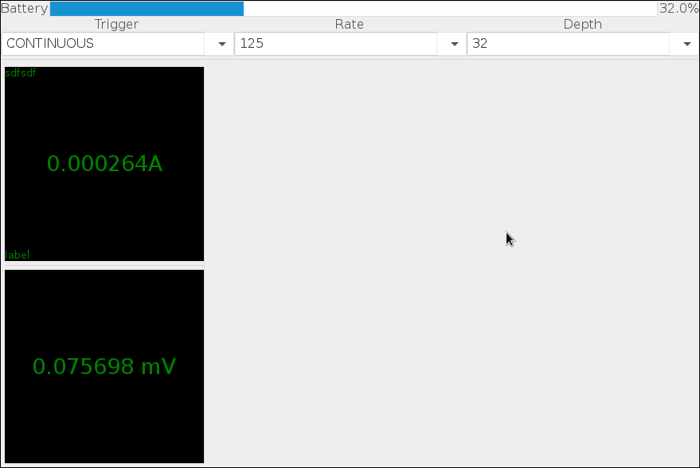

# sooshichef
This is a small demo application using [libsooshi](https://github.com/ghtyrant/libsooshi) to communicate with the [Mooshimeter](http://moosh.im).
It's using Gtk to display input values from both channels.

Its features are currently very limited.

Feel free to open Pull Requests or Issues!

## Screenshots

The current main window. It displays values read from both channels and the current battery level.

## Dependencies
sooshichef links against:
 
 * gtk+-3.0